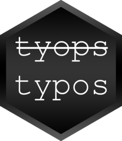

<!-- README.md is generated from README.Rmd. Please edit that file -->

```{r setup, include = FALSE}
knitr::opts_chunk$set(
  collapse = TRUE,
  comment = "#>",
  fig.path = "man/figures/README-",
  out.width = "100%"
)
```

# typos 

<!-- badges: start -->
<!-- badges: end -->

The goal of `typos` is to provide a flexible warning when commonly mis-typed functions are called. Functions with typing errors will still be evaluated and a warning will be output. It also provides the user with a convenient function to define their own typos.

## Installation

You can install the development version of `typos` from [GitHub](https://github.com/) with:

``` r
# install.packages("devtools")
devtools::install_github("MyKo101/typos")
```
## Example

For example, without `typos` installed, the following will throw an error due to the misspelling of `names` as `nameS`:

```{r error-example, error=T}
nameS(iris)
```

But, with `typos`, the function is still evaluated, and rather than an Error, a Warning is produced
```{r nameS-typo, echo=F}
library(typos)
nameS(iris)
```

## Wrapping

All functions declared in `typos` are just wrapper functions around the "proper" function. These wrapper functions also output a warning to let users know that they have made a mistake. The warning includes the call to make it easier for users to fix.

## Generating typos

The key to `typos` is the `.typo()` function which generates the wrapper function. It also comes with a list of exported typos, which can be found [here]("man/Exported-typos.Rd"), by using the command `help("Exported-typos")` or applying the `?` operator to any other Exported typo (e.g. `?nameS`)

To generate your own typo function, just use the following syntax:
```
incorrect <- .typo(correct)
```

For example, the above used `nameS()` function is defined as:
```
nameS <- .typo(names)
```

For the `names()` function, we have a secondary assignment function (for when you want to change the names of an object), and so we need to define that separately (using back-ticks):
```
`nameS<-` <- .typo(`names<-`)
```

What if your function is in another package? Just use the `.package` argument to specify the package for the correct function

```
fitler <- .typo(filter,dplyr)
```

## Typo Alert

It is also possible to specify your own typo alerting function. An typo alert function must take two arguments, the first will be the correct spelling of the function (as a string) and the second will be the call that has caused the typo to trigger (see `?.typo`). 

This can then be done in one of two ways, firstly by specifying it when declaring a typo:

```{r my-error}
My_Error <- function(a,b) warning("Oh No! A Typo!")
nms <- .typo(names,.typo_function=My_error)
nms(iris)

```

Secondly, by overwriting the built-in `.typo_alert()` function, this will also effect the built-in typos as they will then also call your function:

```{r overwrite-error}
.typo_alert <- function(a,b) warning("Look at me. I am the typo alert now")
nameS(iris)
```


